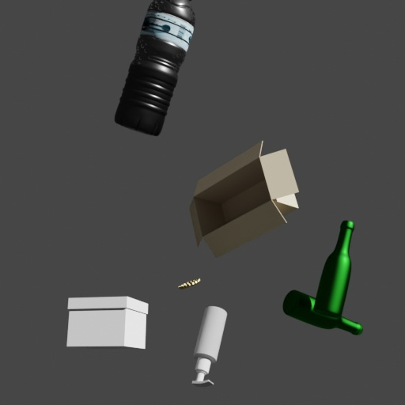
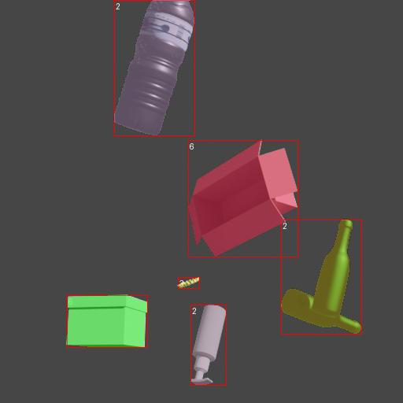

# Trash Proc

 Synthetic dataset generation of waste objects with BlenderProc – render photorealistic images and annotations (RGB, segmentation, COCO) from 3D trash models for machine learning and computer vision.

 <div>
  
  
</div>

## Installation

**Prerequisites:**
- Python 3.8+
- A working Blender executable on PATH (BlenderProc calls Blender to run)

**Step 1: Install Blender**

Head over to the official website of [Blender](https://www.blender.org/). Follow the instructions to download and install the latest version compatible with your system.

**Step 2: Install BlenderProc**

Using pip
```bash
pip install blenderproc==2.8.0
```

Or from source
```bash
git clone https://github.com/BlenderProc/BlenderProc.git
cd BlenderProc
pip install -e .
```

**Step 3: Install requirements**

```
pip install -r requirements.txt
```

**Step 4: Prepare assets**

Download assets: https://drive.google.com/drive/folders/1aag-KRDmPZI6ONJvFsoiZYuKoKlCQzV4?usp=drive_link (access needs to be requested from the author of this repo for now).
Save the contents under assets folder.

Alternatively prepare your own assets:

- download a number of assets (.obj,.mtl or .blend files)
- Create a JSON file at configs/class_mapping.json that maps categories to folder names and ids. Example content:

```json
[
  {
    "class_id": 1,
    "class_name": "bottle",
    "class_dir": "bottles/"
  },
  {
    "class_id": 2,
    "class_name": "can",
    "class_dir": "cans/"
  }
  ...
]
```

Notes:
- class_dir must match the subfolder name under assets/ (e.g. assets/bottles).
- class_id must be a unique integer per category.
- class_name is a human-readable label used in annotations.
- Add or remove entries as needed and keep the file valid JSON.

## Run pipeline

To run the script and start generating images and their annotation run:

```bash
blenderproc run trash_proc.py --num_views 10
```

Images and annotations will be saved to output/coco_data folder.
If you wish to inspect annotations you can call the following command:

```bash
blenderproc vis coco -i 0 -c coco_annotations.json -b output/coco_data
```